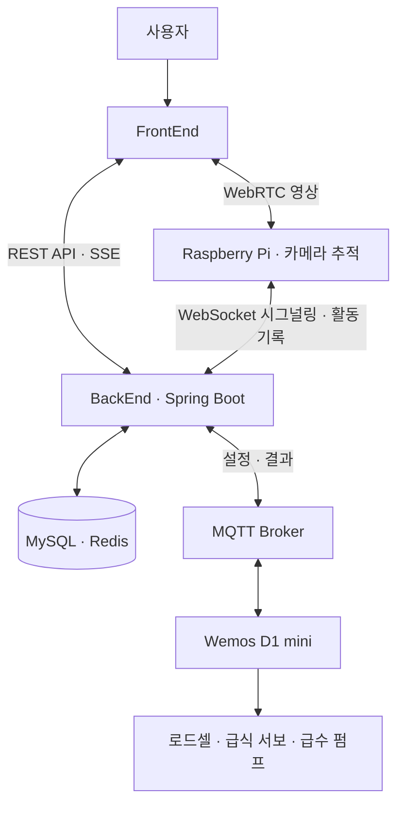

# ganadiCare

### 떨어져 있어도, 반려동물의 일상을 가까이

실시간 홈캠과 자동 급식·급수, 활동 기록을 연결하는 반려동물 케어 프로젝트입니다.

[FrontEnd](https://github.com/ganadiCare/FrontEnd) · [BackEnd](https://github.com/ganadiCare/BackEnd) · [Sensor](https://github.com/ganadiCare/Sensor)

---

## 우리가 만드는 것

집 밖에서도 반려동물의 모습을 살피고, 사료와 물 공급을 설정하고, 하루의 기록을 확인할 수 있는 서비스를 만듭니다.
웹 서비스와 라즈베리파이 카메라, Wemos 기반 급식·급수 장치를 하나의 흐름으로 연결합니다.

| 기능 | 설명 |
| --- | --- |
| 실시간 홈캠 | WebRTC 영상 연결과 반려동물 객체 인식·카메라 추적 |
| 급식·급수 | 예약 급식, 무게 측정 기반 자동 급수, 공급 결과 기록 |
| 활동 기록 | 감지된 반려동물의 활동 정보 수집·조회 |
| 영상 기록 | 녹화 파일 저장·조회·다운로드 |
| 케어 리포트 | 기록을 바탕으로 AI 리포트 생성 및 메모 관리 |
| 실시간 알림 | 급식·급수 완료 결과 전달 |

## 저장소

| Repository | 담당 영역 | 시작하기 |
| --- | --- | --- |
| [FrontEnd](https://github.com/ganadiCare/FrontEnd) | 사용자 웹 화면 | [저장소 보기](https://github.com/ganadiCare/FrontEnd) |
| [BackEnd](https://github.com/ganadiCare/BackEnd) | 인증·API·기록·리포트·장치 통신 | [실행 안내](https://github.com/ganadiCare/BackEnd#readme) |
| [Sensor](https://github.com/ganadiCare/Sensor) | 라즈베리파이 카메라와 Wemos 펌웨어 | [장치 설정](https://github.com/ganadiCare/Sensor#readme) |

## 연결 구조

## 기술 구성

- **서버:** Java 17, Spring Boot, Spring Security, JPA, MySQL, Redis
- **실시간 통신:** WebRTC, WebSocket, MQTT, SSE
- **카메라·인식:** Raspberry Pi 5, Python, OpenCV, Ultralytics YOLO
- **급식·급수:** ESP8266, PlatformIO, HX711, 서보·펌프
- **배포:** Docker, GitHub Actions, Azure VM

## 개발 안내

저장소별 README에서 실행 환경과 설정 방법을 확인할 수 있습니다.
장치 연동은 [Wemos 안내](https://github.com/ganadiCare/Sensor/blob/main/wemos/README.md)와 [MQTT 연동 문서](https://github.com/ganadiCare/BackEnd/blob/develop/MQTT_SETUP.md)를 참고하세요.

현재 장치 연결은 단일 Pi 세션과 공통 MQTT 토픽을 기준으로 구성되어 있습니다.
